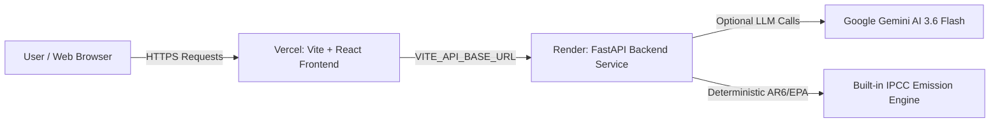

# 🚀 GreenGuide AI — Production Deployment Guide

This guide walks you through deploying **GreenGuide AI** into production using:
- **Render** for the Python FastAPI Backend
- **Vercel** for the React + Vite Frontend

---

## 🏛️ Architecture & Deployment Flow



- **Frontend (Vercel)**: Static Single Page Application (SPA), lightning-fast edge CDN, custom domain support, and automated preview branches.
- **Backend (Render)**: Managed Python web service with automatic SSL, environment variables, health checks, and process management.

---

## 🟢 Part 1: Deploy Backend to Render

### Option A: Render Blueprint (Recommended — One Click Setup)

Because this repository includes a [`render.yaml`](../render.yaml) file, you can deploy using Render Blueprints:

1. Log into your [Render Dashboard](https://dashboard.render.com/).
2. Click **New +** at the top right and select **Blueprint**.
3. Connect your GitHub repository: `swaroop07p/GreenGuideAI-1M1B-Project`.
4. Render will automatically parse `render.yaml` and configure:
   - **Service Name**: `greenguide-ai-backend`
   - **Root Directory**: `backend`
   - **Runtime**: Python 3
   - **Build Command**: `pip install -r requirements.txt`
   - **Start Command**: `uvicorn app.main:app --host 0.0.0.0 --port $PORT`
   - **Health Check Path**: `/api/health`
5. Under **Environment Variables**, optionally set your `GEMINI_API_KEY` (if omitted, the backend runs in high-fidelity deterministic mode).
6. Click **Apply**. Render will build and deploy your backend service.
7. Once deployed, note your service URL (e.g., `https://greenguide-ai-backend.onrender.com`).

---

### Option B: Manual Web Service Setup on Render

If you prefer to configure the service manually via the Render UI:

1. Go to [Render Dashboard](https://dashboard.render.com/) and click **New +** > **Web Service**.
2. Select **Build and deploy from a Git repository** and connect `swaroop07p/GreenGuideAI-1M1B-Project`.
3. Configure the following settings:

| Setting | Value |
| :--- | :--- |
| **Name** | `greenguide-ai-backend` |
| **Region** | Choose the region closest to your audience (e.g., *Oregon (US West)* or *Frankfurt (EU)*) |
| **Branch** | `main` |
| **Root Directory** | `backend` *(Important!)* |
| **Runtime** | `Python 3` |
| **Build Command** | `pip install -r requirements.txt` |
| **Start Command** | `uvicorn app.main:app --host 0.0.0.0 --port $PORT` |
| **Instance Type** | `Free` (or higher) |

4. Scroll down to **Advanced** > **Health Check Path** and enter:
   ```
   /api/health
   ```

5. Under **Environment Variables**, add:
   - `PYTHON_VERSION`: `3.11.9`
   - `ENVIRONMENT`: `production`
   - `ALLOWED_ORIGINS`: `*` *(You can restrict this to your Vercel URL after deploying frontend)*
   - `GEMINI_MODEL`: `gemini-3.6-flash`
   - `GEMINI_API_KEY`: *(Optional) Your Google Gemini API Key*

6. Click **Create Web Service**.
7. Wait for the build to finish. Once you see `Your service is live 🎉`, copy your backend URL:
   ```
   https://greenguide-ai-backend.onrender.com
   ```
8. Verify by opening `https://<your-render-url>/api/health` in your browser. You should see:
   ```json
   {
     "status": "healthy",
     "service": "GreenGuide AI Backend",
     "version": "2.0.0"
   }
   ```

> [!TIP]
> **Render Free Tier Sleep Behavior**: Free services spin down after 15 minutes of inactivity and take ~30–50 seconds to spin up on the first request (cold start). GreenGuide AI includes built-in offline IPCC fallback calculation in the frontend, so users are never blocked even during a backend cold start!

---

## ⚡ Part 2: Deploy Frontend to Vercel

1. Log into [Vercel Dashboard](https://vercel.com/dashboard).
2. Click **Add New...** > **Project**.
3. Import your GitHub repository: `swaroop07p/GreenGuideAI-1M1B-Project`.
4. In the **Configure Project** screen, configure the following settings:

| Setting | Value | Notes |
| :--- | :--- | :--- |
| **Framework Preset** | `Vite` | Should be detected automatically |
| **Root Directory** | Click **Edit** and select `frontend` | **CRITICAL**: Do not leave as root `/`! |
| **Build Command** | `npm run build` | Default |
| **Output Directory** | `dist` | Default |
| **Install Command** | `npm install` | Default |

5. Expand the **Environment Variables** section and add:

| Key | Value | Example |
| :--- | :--- | :--- |
| `VITE_API_BASE_URL` | Your Render Backend URL *(no trailing slash)* | `https://greenguide-ai-backend.onrender.com` |

6. Click **Deploy**.
7. Vercel will install dependencies, run the optimized Vite build, and deploy your site in ~30–45 seconds.
8. You will receive your live domain, for example:
   ```
   https://greenguide-ai.vercel.app
   ```

---

## 🔗 Part 3: Lock Down CORS & Connect

To lock down cross-origin resource sharing to your production domain:

1. Copy your live Vercel URL (e.g. `https://greenguide-ai.vercel.app`).
2. Go back to your [Render Dashboard](https://dashboard.render.com/) > Select `greenguide-ai-backend` > **Environment**.
3. Update the `ALLOWED_ORIGINS` variable:
   ```
   ALLOWED_ORIGINS=https://greenguide-ai.vercel.app,http://localhost:5173
   ```
4. Click **Save Changes**. Render will automatically restart your web service with the updated CORS policy.

---

## ✅ Part 4: Production Verification Checklist

Once both services are deployed, test the full application workflow:

- [ ] **Backend Health Check**: Visit `https://<render-url>/api/health` — returns status `healthy`.
- [ ] **API Documentation**: Visit `https://<render-url>/docs` — displays Swagger UI.
- [ ] **Frontend Loading**: Open your Vercel URL — page renders smoothly with modern typography and dark/light mode toggle.
- [ ] **Footprint Calculation**: Fill out the 4-step wizard and click **Calculate My Footprint**.
  - Confetti fires upon calculation.
  - Category breakdown, Eco Score gauge, and benchmarks render.
  - Personalized recommendations and 4-week roadmap appear.
- [ ] **What-If Simulator**: Move the lifestyle sliders (Transit, Meat-Free, Electricity, Solar) — verify instantaneous recalculated metrics.
- [ ] **AI Sustainability Chat**: Ask a climate question in the assistant modal.
- [ ] **Transparency Panel**: Click **Transparency & IPCC Methodology** in the header or footer to inspect live emission factors.
- [ ] **Print / Export PDF**: Click **Print / Export PDF** on the results screen to verify the print-styled 2-page report.
- [ ] **Client Key Override**: Test opening the **Gemini Key Settings** modal and entering a custom Gemini API key.

---

## 🛠️ Summary of Environment Variables

### Backend (Render)
| Variable | Required? | Default | Description |
| :--- | :---: | :---: | :--- |
| `PORT` | Auto | `10000` / `8000` | Automatically injected by Render |
| `HOST` | Auto | `0.0.0.0` | Bound to all interfaces in production |
| `ENVIRONMENT` | Recommended | `production` | Enables production uvicorn mode |
| `ALLOWED_ORIGINS` | Optional | `*` | Allowed CORS origins (comma-separated or `*`) |
| `GEMINI_API_KEY` | Optional | *(None)* | Server-side Gemini API key fallback |
| `GEMINI_MODEL` | Optional | `gemini-3.6-flash` | Gemini model version |
| `PYTHON_VERSION` | Recommended | `3.11.9` | Render Python runtime version |

### Frontend (Vercel)
| Variable | Required? | Default | Description |
| :--- | :---: | :---: | :--- |
| `VITE_API_BASE_URL` | **Yes (in prod)** | `""` (proxy) | HTTPS URL of your Render backend without trailing slash |

---

## ❓ Troubleshooting

### 1. CORS Errors in Browser Console
- **Symptom**: `Access to fetch at '...' from origin '...' has been blocked by CORS policy`.
- **Fix**: Check `ALLOWED_ORIGINS` in Render environment settings. Ensure it either equals `*` or includes your exact Vercel URL (e.g. `https://greenguide-ai.vercel.app`, without trailing slashes).

### 2. Network Error / Cold Start on Render Free Tier
- **Symptom**: First calculation takes ~30 seconds or falls back to client calculations.
- **Explanation**: Render Free Tier services spin down when inactive. When the first request arrives, Render wakes the container.
- **Solution**: The application is built to handle this gracefully: it automatically falls back to deterministic IPCC calculations so the user experience is never broken. Subsequent requests respond in milliseconds. If you need zero cold starts, upgrade Render to the Starter tier ($7/mo) or ping `/api/health` with a service like UptimeRobot every 14 minutes.

### 3. Vercel 404 on API Calls
- **Symptom**: Requests to `/api/calculate-footprint` return `404 Not Found` on Vercel.
- **Fix**: You forgot to set `VITE_API_BASE_URL` in Vercel project environment variables! Set `VITE_API_BASE_URL=https://<your-render-service>.onrender.com` in Vercel > Settings > Environment Variables, then click **Redeploy**.
