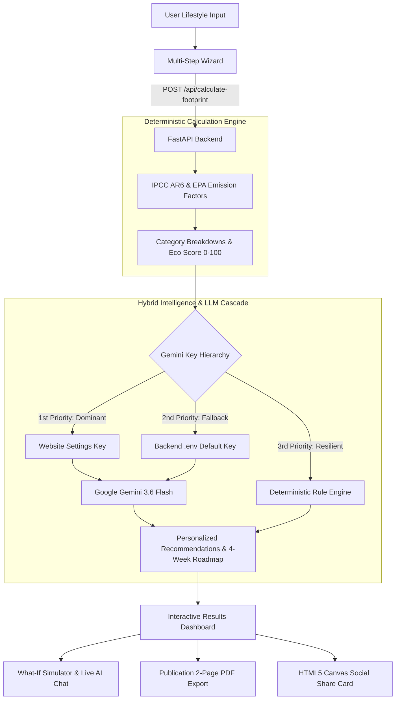

# 🌿 GreenGuide AI — Personal Sustainability & Carbon Footprint Advisor

<div align="center">

[](https://sdgs.un.org/goals/goal13)&nbsp;&nbsp;&nbsp;&nbsp;
[](https://sdgs.un.org/goals/goal12)&nbsp;&nbsp;&nbsp;&nbsp;

[](https://sdgs.un.org/goals/goal11)


[](https://fastapi.tiangolo.com)&nbsp;&nbsp;&nbsp;
[](https://vitejs.dev)&nbsp;&nbsp;&nbsp;

[](https://tailwindcss.com)&nbsp;&nbsp;&nbsp;
[](https://ai.google.dev)

<br />
<br />

<p align="center">
  <strong>An intelligent, privacy-first personal decarbonization platform that transforms everyday lifestyle habits into measurable climate action aligned with the Paris 1.5°C Agreement.</strong>
</p>

</div>

---

## 📖 Overview

**GreenGuide AI** bridges the gap between complex climate science and practical lifestyle change. By pairing deterministic greenhouse gas (GHG) calculations rooted in the **IPCC Sixth Assessment Report (AR6)** and **US EPA emission factors** with state-of-the-art **Google Gemini AI reasoning**, GreenGuide AI delivers:
- Precise, honest footprint metrics across **Energy**, **Transport**, **Food**, and **Waste**.
- Tailored, high-impact recommendations ranked by leverage.
- A dynamic **4-Week Decarbonization Roadmap** with actionable checklists.
- An interactive **What-If Simulator** and live **Gemini AI Sustainability Chat Assistant**.
- A publication-grade, balanced **2-Page PDF Assessment Report** designed for browser printing.
- Complete **Zero-Database Privacy** with local browser session comparisons.

---

## 🏗️ Architecture & Data Flow



---

## 🌟 Core Features

### 1. 📋 Intuitive Multi-Step Form Wizard
- **Segmented Domain Flow**: Guided progression through Energy & Housing (⚡), Mobility & Commuting (🚗), Food & Nutrition (🥗), and Waste & Circularity (♻️).
- **Smart Accessibility**: Dynamic color-graded sliders, accessible custom selects, and instant validation.
- **Instant "Fill Sample" Demo**: One-click sample population for rapid demonstration and testing.
- **Transparent Assumptions**: All questions are optional; unselected fields automatically trigger transparent baseline physical models.

### 2. 📊 Executive Results Dashboard & Metrics
- **Dynamic Metric / Imperial Toggle**: Seamless switching between metric (`kg CO2e`) and imperial (`lb CO2e`) units across all charts and metrics.
- **Eco Score (0–100) & Radial Gauge**: Non-judgmental, motivating scoring system calibrated against the Paris 1.5°C target (~167 kg CO2e/month) with festive confetti celebrations.
  - 🏆 *Climate Hero* (85–100)
  - 🌿 *Low Carbon Pioneer* (70–84)
  - ⚡ *On Track* (55–69)
  - 🔄 *Transitioning* (40–54)
  - 🎯 *High Impact Opportunity* (< 40)
- **Interactive Visualizations**: Recharts donut distribution and categorical breakdown charts comparing Energy, Transport, Food, and Waste.
- **Comparative Global Benchmarks**: Real-time visual comparison against Global Average (390 kg/mo), National Average (360 kg/mo), and Sustainable Target (167 kg/mo).

### 3. 🤖 Hybrid Intelligence & Gemini 3.6 Flash
- **No Hallucinated Arithmetic**: Calculations remain strictly mathematical; the LLM synthesizes personalized behavioral strategies.
- **Personalized High-Impact Recommendations**: 4–6 prioritized interventions citing the user's specific answers, complete with difficulty badges (*Easy*, *Medium*, *High Impact*) and monthly carbon reduction estimates.
- **4-Week Progressive Action Plan**: Week 1 Quick Wins, Week 2 Habit Shifts, Week 3 Kitchen & Circularity, Week 4 Long-term Paris Alignment.
- **Multi-Model Fallback Cascade**: `gemini-3.6-flash` → `gemini-3.5-flash-lite` → `gemini-3.1-flash-lite` → deterministic fallback.

### 4. 🔑 API Key Precedence & Dominance System
- **Website Settings Dominance**: Users can enter their personal Gemini API key in the website settings modal (`ApiKeyModal.jsx`). When provided, it **strictly dominates** over the backend default `.env` key across all endpoints.
- **Live Key Verification (`POST /api/validate-key`)**: Users can test key connectivity with a single click before saving.
- **Visual Status Hierarchy**:
  - 👑 *Website API Key Active* (Dominating backend default key).
  - ⚡ *Default Backend Key Active* (`.env` configured out-of-the-box).
  - ⚪ *Deterministic Mode* (Offline mathematical calculation fallback).
- **Zero Server Storage**: User API keys are stored solely in browser `localStorage` and sent via encrypted request headers (`X-Gemini-API-Key`).

### 5. 💬 Interactive What-If Simulator & Live AI Chat
- **Real-Time Formula Sliders**: Instant 60fps recalculations for transit shifts, vegetarian days, electricity reduction, and composting without extra LLM overhead.
- **Live Gemini Chat Assistant (`WhatIfAIChat`)**: Conversational advisor answering queries about carbon metrics, carbon offsets, EV savings, and custom lifestyle trade-offs without pre-canned answers.
- **Goal Setting Widget**: Target reduction commitments (-10%, -20%, -30%, Paris Target) with projected monthly savings.

### 6. 🖨️ Publication-Grade 2-Page PDF Report
- **CSS `@media print` Layout**: Optimized for A4 portrait printing and instant browser PDF download.
- **Zero Empty Space**: Re-engineered 2-page balanced layout:
  - **Page 1 (Assessment & Interventions)**: Executive KPI overview, side-by-side Domain Breakdown table & Assessment Interpretation narrative, and 4 Priority Decarbonization Action cards.
  - **Page 2 (Roadmap & Scientific Transparency)**: 4-Week Action Implementation Plan, IPCC AR6 & EPA methodology standards, session assumptions, Paris 1.5°C trajectory guidance, and official UN SDG verification footer.
- **True Print Colors**: Full ink preservation for badges, progress bars, and domain distribution charts.

### 7. 🎨 Social Impact Share Card & Opt-In Comparison
- **HTML5 Canvas Card Generator**: High-resolution, public-safe image card summarizing Eco Score, tier, and top tip for social sharing and SDG 13 advocacy.
- **Local Session Comparison**: Opt-in `localStorage` snapshot comparison allowing "before vs. after" progress checks with zero server tracking.

### 8. 🛡️ Scientific Transparency & Privacy by Design
- **Slide-Out Transparency Panel**: Complete methodology drawer displaying live emission factors, conversion formulas, and scientific citations (IPCC, US EPA, UK DEFRA, CEA).
- **100% Private & Anonymous**: Zero user accounts, zero cookies, zero database storage.

---

## 🛠️ Technology Stack

| Layer | Technologies | Description |
| :--- | :--- | :--- |
| **Frontend Core** | React 19, Vite 8, JavaScript (ESM) | Ultra-fast client application with modern hooks and state |
| **Styling & Design** | TailwindCSS v4 (`@tailwindcss/vite`), Vanilla CSS | Design system with glassmorphism, responsive grid, and dark/light modes |
| **Data Visualization** | Recharts, SVG, Canvas Confetti | Responsive donut, bar, radial score gauges, and celebratory animations |
| **Icons & Assets** | Lucide React | Modern, consistent iconography across all domains |
| **Backend API** | FastAPI, Python 3.10+, Uvicorn | High-performance asynchronous REST API |
| **Data Validation** | Pydantic v2 | Strict request/response schema modeling and input sanitization |
| **Generative AI** | Google Gemini API (`google-genai` SDK) | `gemini-3.6-flash` multi-model cascade for personalized reasoning |
| **Security & Limits** | In-Memory Sliding-Window Limiter | Rate limiting protection on calculation and chat endpoints |

---

## 📡 API Endpoints Reference

| Method | Endpoint | Description | Key Header / Payload |
| :--- | :--- | :--- | :--- |
| `GET` | `/api/health` | Service health, readiness, and SDG alignment | None |
| `GET` | `/api/emission-factors` | Scientific reference factors, citations, and version metadata | None |
| `GET` | `/api/gemini-status` | Active API key status and source (`website_settings` vs `backend_env`) | Optional `X-Gemini-API-Key` |
| `POST` | `/api/validate-key` | Lightweight test call verifying Gemini API key validity and quota | `{ "api_key": string }` or header |
| `POST` | `/api/calculate-footprint` | Computes deterministic footprint + Gemini recommendations & action plan | `FootprintRequest`, optional key header |
| `POST` | `/api/whatif-recalculate` | Instant formula-based recalculation for simulator sliders | `WhatIfRequest` |
| `POST` | `/api/compare-benchmarks` | Statistical comparison against global, national, and Paris targets | `{ "monthly_kg": float }` |
| `POST` | `/api/generate-share-card` | Sanitized public metadata for client-side HTML5 canvas card | `{ "total_monthly_kg": float, ... }` |
| `POST` | `/api/chat` | Live conversational Gemini sustainability advisor & clarifier | `ChatRequest`, optional key header |

---

## 🚀 Quickstart Guide

### Prerequisites
- **Node.js** (v18+)
- **Python** (v3.10+)

### 1. Backend Setup

```bash
# 1. Navigate to the backend directory
cd backend

# 2. (Optional) Create and activate a virtual environment
python -m venv venv
# On Windows:
venv\Scripts\activate
# On macOS/Linux:
source venv/bin/activate

# 3. Install dependencies
pip install -r requirements.txt

# 4. (Optional) Configure Gemini API key
# If omitted, the backend runs in high-fidelity deterministic fallback mode!
copy .env.example .env

# 5. Start the FastAPI server
python run.py
```
> Backend runs at **`http://127.0.0.1:8000`** (Interactive Swagger Docs at **`http://127.0.0.1:8000/docs`**).

---

### 2. Frontend Setup

```bash
# 1. In a separate terminal, navigate to the frontend directory
cd frontend

# 2. Install dependencies
npm install

# 3. Start the Vite development server
npm run dev
```
> Frontend runs at **`http://localhost:5173`** (proxies `/api` requests to backend at port `8000`).

---

### 3. Production Build

To validate or create the production bundle:
```bash
cd frontend
npm run build
```

---

## 🌍 UN Sustainable Development Goals (SDG) Alignment

GreenGuide AI is directly mapped to the United Nations 2030 Agenda:

| SDG | Target | GreenGuide AI Implementation |
| :--- | :--- | :--- |
| **SDG 13: Climate Action** | **13.3**: Improve education, awareness, and institutional capacity on climate change mitigation. | Provides transparent personal footprint assessments and benchmarks aligned with the Paris 1.5°C boundary (~167 kg CO2e/month). |
| **SDG 12: Responsible Consumption** | **12.3 & 12.5**: Substantially reduce waste generation through prevention, reduction, recycling, and composting. | Promotes plant-rich dietary alternatives, food waste tracking, and domestic organic composting. |
| **SDG 11: Sustainable Cities** | **11.2**: Provide access to safe, affordable, accessible, and sustainable transport systems. | Evaluates commuting impact and calculates carbon savings from shifting to public transit, cycling, and walking. |

---

## 🔒 Privacy, Security & Data Ethics

- **Zero Data Collection**: No cookies, no session tracking, and no server databases.
- **No Shaming**: Results and blurb narratives are encouraging, constructive, and focused on agency.
- **Transparent Methodology**: Every factor and conversion constant is viewable in the Transparency Panel.
- **Key Safety**: Personal API keys are stored solely in the client's browser and take precedence without persisting to backend disk.

---

## 📄 License

This project is developed for educational, open-source, and climate action advocacy purposes. Released under the [MIT License](LICENSE).
